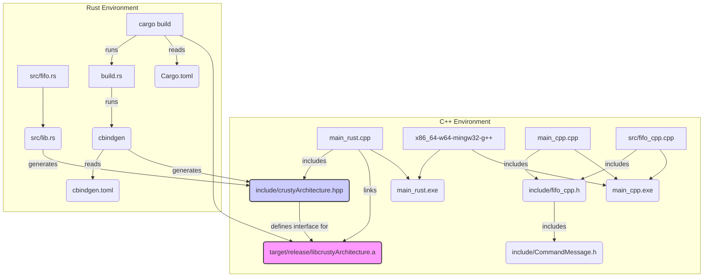

## System Design Document: CRUST/y Architecture Proof-of-Concept

**Version:** 1.1
**Date:** 2025-03-28

**1. Introduction**

This document describes the system design for the CRUST/y (C++/Rust) architecture proof-of-concept (PoC). The primary goal of CRUST/y is to enable the use of Rust code within a C++ compiled environment, leveraging Rust's memory safety features for specific, potentially memory-sensitive operations, accessed via a Foreign Function Interface (FFI).

This PoC demonstrates the core concept using a simple FIFO (First-In, First-Out) queue implemented in Rust and accessed from C++. It also includes a baseline pure C++ implementation for comparison.

**Core Interaction Pattern (CRUSTy Version):**
In the CRUSTy approach demonstrated here (`main_rust.exe`), the roles are clearly delineated:

- **Rust:** Manages the underlying FIFO queue mechanism, including data storage, internal state (empty/full), and thread safety. It handles the core queue logic and data transport _within_ the queue structure itself, exposing this functionality via the FFI.
- **C++:** Acts as the driver or consumer. It interacts with the Rust-managed queue through the defined FFI functions (`init_fifo`, `simulate_interrupt`, `read_fifo`, `destroy_fifo`). C++ sends commands/data _to_ the Rust queue and receives messages _from_ it. Once a message is retrieved from Rust, the C++ code is responsible for processing or acting upon that message.

The eventual target for this architecture is a bare-metal embedded system with significant memory constraints. Size optimization efforts have successfully reduced the CRUST/y executable (`main_rust.exe`) size to be comparable to the C++ baseline (`main_cpp.exe`), demonstrating feasibility for such environments.

**2. System Architecture**

The PoC consists of the following main components:

- **C++ Application (`main_rust.exe`):** The primary C++ executable that utilizes the Rust library's functionality.
- **Rust FFI Library (`libcrustyArchitecture.a`):** A statically linked Rust library containing the memory-safe implementation (currently a FIFO queue).
- **FFI Boundary (`include/crustyArchitecture.hpp`):** A C++ header file automatically generated by `cbindgen` from Rust code, defining the interface (functions and data structures) between C++ and Rust.
- **C++ Baseline (`main_cpp.exe`):** A separate C++ executable demonstrating a pure C++ implementation of the same functionality (FIFO queue) for comparison.



**3. Build System**

- **Orchestration:** A top-level `Makefile` orchestrates the build process.
- **Rust Compilation:**
  - Uses `cargo build --release --target x86_64-pc-windows-gnu` to compile the Rust library (`crustyArchitecture`) for the specified target.
  - The library is built in `#![no_std]` mode, eliminating the Rust standard library dependency.
  - `Cargo.toml` defines:
    - Library name (`crustyArchitecture`), crate type (`staticlib`).
    - Build dependencies: `cbindgen`.
    - Dependencies: `heapless` (for static collections), `panic-halt` (panic handler), `spin` (for mutex).
    - Release profile optimizations (`opt-level = "z"`, `lto = true`, `codegen-units = 1`, `strip = true`, `panic = "abort"`) to minimize size.
  - A `build.rs` script automates the generation of the C++ header file using the `cbindgen` crate.
  - `cbindgen.toml` configures `cbindgen` output (namespace, include guard).
  - The output is a static library (`target/x86_64-pc-windows-gnu/release/libcrustyArchitecture.a`).
- **C++ Compilation:**
  - Uses `x86_64-w64-mingw32-g++` (MinGW for Windows).
  - `Makefile` sets `CXXFLAGS = -Wall -std=c++17 -I./include -Os` (optimizing for size).
  - `Makefile` sets `LDFLAGS = -s` (stripping symbols from the final executable).
  - Compiles `main_rust.cpp` and statically links it against the Rust library and necessary system/runtime libraries (`-L./target/x86_64-pc-windows-gnu/release -lcrustyArchitecture -lws2_32 -luserenv -lntdll -lstdc++ -lgcc_s -lgcc -ladvapi32 -lkernel32 -lmingwex -lmsvcrt`) to create `main_rust.exe`.
  - Compiles `main_cpp.cpp` to create `main_cpp.exe` (does not link the Rust library).
- **Cleaning:** `make clean` removes executables (`*.exe`) and Rust build artifacts (`cargo clean`). The command uses `del` for Windows compatibility.

**4. FFI Interface (`crustyArchitecture`)**

- **Purpose:** To expose Rust functionality (FIFO queue) to C++ code in a C-compatible manner.
- **Header Generation:** `include/crustyArchitecture.hpp` is automatically generated by `cbindgen` via `build.rs` during the `cargo build` process.
- **Namespace:** All generated C++ types and functions reside within the `crustyArchitecture` namespace.
- **Data Structures:**
  - `CommandMessage`: A struct defined in Rust with `#[repr(C)]` and `#[derive(Copy, Clone)]`. Contains `command_id` (int32_t) and `data` (uint8_t[64]). Mirrored in the generated C++ header.
- **Functions (within `extern "C"` block):**
  - `void* init_fifo()`: Initializes the static Rust FIFO instance. Returns a non-null opaque handle (`void*`, specifically `1 as *mut c_void`) on success, or `null_mut()` if already initialized. This handle acts purely as a status indicator for C++.
  - `CommandMessage read_fifo(void* fifo_handle)`: Reads the next message from the FIFO. Requires the non-null handle from a successful `init_fifo`. Returns a `CommandMessage` with `command_id = -1` if the FIFO is empty, or `command_id = -3` if called with a null handle or before initialization/after destruction.
  - `int32_t simulate_interrupt(void* fifo_handle, int32_t command_id, const uint8_t *data, uintptr_t data_len)`: Sends a message into the FIFO. Requires the non-null handle. Returns `0` on success, `-1` if the FIFO is full, or `-2` if called with a null handle or before initialization/after destruction.
  - `void destroy_fifo(void* fifo_handle)`: Destroys the static Rust FIFO instance, cleaning up its internal state. Requires the non-null handle. Safe to call multiple times or with a null handle (becomes a no-op).
- **Memory Management:** The Rust library uses static allocation (`static FIFO_STATE: Mutex<FifoState>`) for the FIFO queue and its producer/consumer handles. No heap allocation (`Box`, `Arc`) is used. The C++ code receives an opaque `void*` handle from `init_fifo` which merely indicates success/failure and must be passed back to other Rust functions. C++ calls `destroy_fifo` to signal Rust to clean up the static state (drop producer/consumer, mark as uninitialized) within a mutex lock.

**5. C++ Application (`main_rust.exe`)**

- **Purpose:** Demonstrates interaction with the Rust FFI library.
- **Implementation (`main_rust.cpp`):**

  - Includes `<iostream>`, `<cstdint>`, and the generated `include/crustyArchitecture.hpp`.
  - Calls `crustyArchitecture::init_fifo()` to get the opaque `void*` handle.
  - Calls `crustyArchitecture::simulate_interrupt()` in a loop to send messages.
  - Calls `crustyArchitecture::read_fifo()` in a loop to receive messages, checking the `command_id` for status (-1: empty, -2: disconnected).
  - Calls `crustyArchitecture::destroy_fifo()` to clean up the Rust object before exiting.

- **Execution Flow Diagram (ASCII):**

  ```text
  +--------------------------------+        +-------------------------------------+
  | C++ Application (main_rust.exe)|        | Rust FFI Library (no_std FIFO)      |
  +--------------------------------+        +-------------------------------------+
                |                                         |
                | 1. Program Start                        |
                |                                         |
                | 2. Call init_fifo()-------------------> | [Locks Mutex]                       |
                |    (Get handle)                         | Initialize static Queue, P/C        |
                |                                         | [Unlocks Mutex]                     |
                |    <------------------------------------| Return SUCCESS_HANDLE (e.g., 0x1) |
                |                                         |
                | 3. Start Send Loop (i=0 to 4)           |
                |    - Prepare msg data (ID=i)            |
                |    - Call simulate_interrupt(handle, i, data)--> | [Locks Mutex]               |
                |                                         | Get Producer handle             |
                |                                         | Enqueue msg (ID=i)              |
                |                                         | [Unlocks Mutex]                 |
                |    <------------------------------------| Return status (0=OK, -1=Full) |
                |    (Repeat 5 times)                     |                                 |
                |                                         |                                 |
                | 4. Start Read Loop (i=0 to 4)           |                                 |
                |    - Call read_fifo(handle)-----------> | [Locks Mutex]                   |
                |                                         | Get Consumer handle             |
                |                                         | Dequeue msg                     |
                |                                         | [Unlocks Mutex]                 |
                |    <------------------------------------| Return CommandMessage (ID=i or -1) |
                |    - Process msg (Print ID)             |                                 |
                |    (Repeat 5 times)                     |                                 |
                |                                         |                                 |
                | 5. Call destroy_fifo(handle)----------->| [Locks Mutex]                   |
                |                                         | Drop P/C handles, clear state   |
                |                                         | [Unlocks Mutex]                 |
                |    <------------------------------------| Return (void)                   |
                |                                         |                                 |
                | 6. Program Exit                         |                                 |
                |                                         |                                 |

  ```

**6. Rust Library (`libcrustyArchitecture.a`) - `no_std` Implementation**

- **Purpose:** Provides a memory-safe, size-optimized implementation of the FIFO queue suitable for `no_std` environments.
- **Implementation (`src/fifo.rs`):**
  - Compiled with `#![no_std]`.
  - Uses a statically allocated `heapless::spsc::Queue` with a fixed capacity (`QUEUE_CAPACITY`).
  - Defines a `FifoState` struct containing `MaybeUninit` fields for the queue, producer, consumer, and an `initialized` boolean flag.
  - A single static instance `FIFO_STATE: Mutex<FifoState>` holds the entire state, using `spin::Mutex` for safe concurrent access during initialization and destruction.
  - `init_fifo`: Locks the mutex, initializes the queue, splits it into producer/consumer (casting to `'static` lifetime via `unsafe`), stores them in the state, sets `initialized = true`, and returns a constant non-null pointer (`SUCCESS_HANDLE`) as a success indicator. Returns `null_mut()` if already initialized.
  - `read_fifo` / `simulate_interrupt`: Lock the mutex, check if initialized, get a mutable reference to the consumer/producer (via `unsafe` pointer access within the lock), perform the dequeue/enqueue operation, and return status/message.
  - `destroy_fifo`: Locks the mutex, checks if initialized, explicitly drops the producer and consumer handles stored in the state using `ptr::drop_in_place`, and sets `initialized = false`.
  - Uses `core` library components (`core::ffi::c_void`, `core::mem::MaybeUninit`, `core::ptr`, `core::cmp`, `core::slice`).
  - Uses `panic-halt` crate for panic handling.
  - FFI functions are marked `extern "C"` and `#[no_mangle]`.
  - The `CommandMessage` struct is marked `#[repr(C)]` and `#[derive(Copy, Clone)]` (required by `heapless`).

**7. C++ Baseline (`main_cpp.exe`)**

- **Purpose:** Provides a pure C++ implementation of the FIFO logic for comparison or as a baseline.
- **Implementation:**
  - `main_cpp.cpp`: Main application logic, includes `fifo_cpp.h`.
  - `include/fifo_cpp.h`: Declares C++ functions (`init_fifo_cpp`, `read_fifo_cpp`, `simulate_interrupt_cpp`) and includes `CommandMessage.h`.
  - `include/CommandMessage.h`: Defines the `CommandMessage` struct (structurally identical to the Rust/generated one, but defined separately).
  - `src/fifo_cpp.cpp`: Implements the FIFO functions using a simple `std::vector` as the underlying queue (not thread-safe).

**8. Future Considerations (Embedded Target)**

- **Memory Footprint:** The transition to `no_std` using `heapless` and static allocation, combined with build optimizations (`opt-level="z"`, `lto=true`, `strip=true`, C++ `-Os`, linker `-s`), has successfully reduced the `main_rust.exe` size (~20KB) to be comparable to the optimized C++ baseline (~19KB). This meets the size constraints for typical embedded systems.
- **Error Handling:** The current error handling uses return values:
  - `init_fifo`: `null` handle indicates failure (already initialized).
  - `read_fifo`: `command_id = -1` (empty), `command_id = -3` (invalid state/handle).
  - `simulate_interrupt`: `0` (success), `-1` (queue full), `-2` (invalid state/handle).
    This seems adequate for the PoC, but a production system might prefer distinct error codes or an enum if more failure modes are added. The use of `panic-halt` means Rust panics (e.g., from `spin::Mutex` poisoning, though unlikely here) will halt the system.
- **Build Toolchain:** The `Makefile` uses `x86_64-w64-mingw32-g++` and `cargo build --target x86_64-pc-windows-gnu`. For the target embedded system, appropriate cross-compilation toolchains (e.g., `arm-none-eabi-gcc` for C++, and the corresponding Rust target like `thumbv7em-none-eabihf`) will be required. The `Makefile` and `cargo` configuration (`.cargo/config.toml`) will need updates for the target architecture.
- **Concurrency:** The current Rust implementation uses a `spin::Mutex` primarily for safe initialization/destruction of the static state. It assumes C++ calls `read_fifo` from only one thread (consumer) and `simulate_interrupt` from only one thread (producer), consistent with SPSC. If C++ might call these concurrently or call `destroy_fifo` concurrently with reads/writes, the locking within `read_fifo` and `simulate_interrupt` might need to be re-evaluated or a different queue type (like `heapless::mpmc::Queue` with appropriate locking) considered.
- **Real Hardware:** The Rust function name `simulate_interrupt` suggests interaction with hardware. The actual implementation will need to replace the simple enqueue with hardware-specific logic, potentially involving interrupt handlers calling `simulate_interrupt` (or a variant) safely.
- **Redundant `CommandMessage.h`:** The project still has `include/CommandMessage.h` used only by the C++ baseline. This could be removed if the baseline is no longer needed, or the baseline could be updated to include `crustyArchitecture.hpp`.
